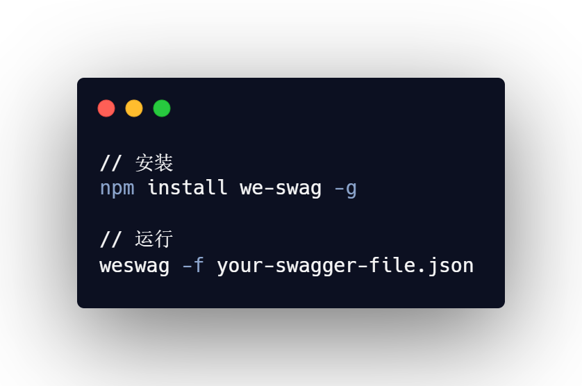

[![Contributors][contributors-shield]][contributors-url]
[![Forks][forks-shield]][forks-url]
[![Stargazers][stars-shield]][stars-url]
[![Issues][issues-shield]][issues-url]

<br />
<p align="center">
 <a href="https://github.com/legenself/we-swag">
 
 </a>
 <h3 align="center">We-Swag</h3>
 <p align="center">
 一个根据swagger.json 快速生成请求文件的工具
 <br />
 <a href="https://github.com/legenself/we-swag"><strong>Explore the docs »</strong></a>
 <br />
 <br />
 <!-- <a href="https://github.com/othneildrew/Best-README-Template">View Demo</a>
 ·
 <a href="https://github.com/othneildrew/Best-README-Template/issues">Report Bug</a>
 ·
 <a href="https://github.com/othneildrew/Best-README-Template/issues">Request Feature</a>-->
 </p>
</p>

## 概述
- [概述](#概述)
- [关于这个项目](#关于这个项目)
  - [第三方工具](#第三方工具)
- [开始使用](#开始使用)
  - [安装方法](#安装方法)
  - [使用方法](#使用方法)
- [待开发功能](#待开发功能)


## 关于这个项目
一个为了提高微信小程序对接后端接口效率的小工具

### 第三方工具
它通过njk模板文件和swagger的json data，快速生成微信小程序的request
- swagger
- njk

## 开始使用

### 安装方法
```
npm install we-swag -g
```
### 使用方法
```
weswag -u [你的swagger.json文件地址] -t [你的njk模版路径] -o [输出文件名] -p [swagger json预处理函数]
```

```
node weswag.js  -u http://132.232.166.224:8989/swagger/v1/swagger.json -t schemaTemplate -p ./schemaprocess.js
```

## 待开发功能
- 通过远程地址生成request 文件
- 通过自定义模板生成文件


[contributors-shield]: https://img.shields.io/github/contributors/legenself/we-swag.svg?style=flat-square
[contributors-url]: https://github.com/legenself/we-swag/graphs/contributors
[forks-shield]: https://img.shields.io/github/forks/legenself/we-swag.svg?style=flat-square
[forks-url]: https://github.com/legenself/we-swag/network/members
[stars-shield]: https://img.shields.io/github/stars/legenself/we-swag.svg?style=flat-square
[stars-url]: https://github.com/legenself/we-swag/stargazers
[issues-shield]: https://img.shields.io/github/issues/legenself/we-swag.svg?style=flat-square
[issues-url]: https://github.com/legenself/we-swag/issues