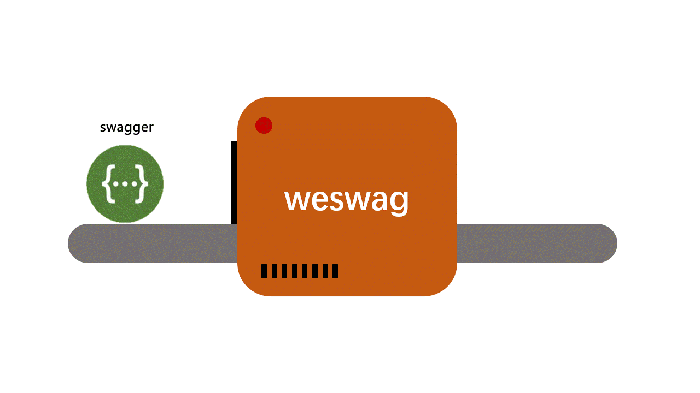

[![Contributors][contributors-shield]][contributors-url]
[![Forks][forks-shield]][forks-url]
[![Stargazers][stars-shield]][stars-url]
[![Issues][issues-shield]][issues-url]

<br />
<p align="center">
 <a href="https://github.com/legenself/we-swag">
 
 </a>
 <h3 align="center">We-Swag</h3>
 <p align="center">
 一个根据swagger.json 快速生成请求文件的工具
 <br />
 <a href="https://github.com/legenself/we-swag"><strong>Explore the docs »</strong></a>
 <br />
 <br />
 <!-- <a href="https://github.com/othneildrew/Best-README-Template">View Demo</a>
 ·
 <a href="https://github.com/othneildrew/Best-README-Template/issues">Report Bug</a>
 ·
 <a href="https://github.com/othneildrew/Best-README-Template/issues">Request Feature</a>-->
 </p>
</p>

## Table of Contents
* [About the Project](#about-the-project)
 * [Built With](#built-with)
* [Getting Started](#getting-started)
 * [Prerequisites](#prerequisites)
 * [Installation](#installation)
* [Usage](#usage)
* [Roadmap](#roadmap)
* [Contributing](#contributing)
* [Contact](#contact)
* [Acknowledgements](#acknowledgements)
## 安装方法
```
npm install we-swag
```
## 使用方法
```
weswag -f [你的swagger.json文件路径]
```


[contributors-shield]: https://img.shields.io/github/contributors/legenself/we-swag.svg?style=flat-square
[contributors-url]: https://github.com/legenself/we-swag/graphs/contributors
[forks-shield]: https://img.shields.io/github/forks/legenself/we-swag.svg?style=flat-square
[forks-url]: https://github.com/legenself/we-swag/network/members
[stars-shield]: https://img.shields.io/github/stars/legenself/we-swag.svg?style=flat-square
[stars-url]: https://github.com/legenself/we-swag/stargazers
[issues-shield]: https://img.shields.io/github/issues/legenself/we-swag.svg?style=flat-square
[issues-url]: https://github.com/legenself/we-swag/issues